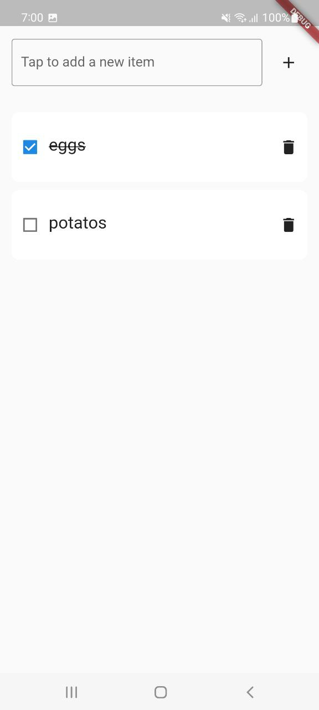
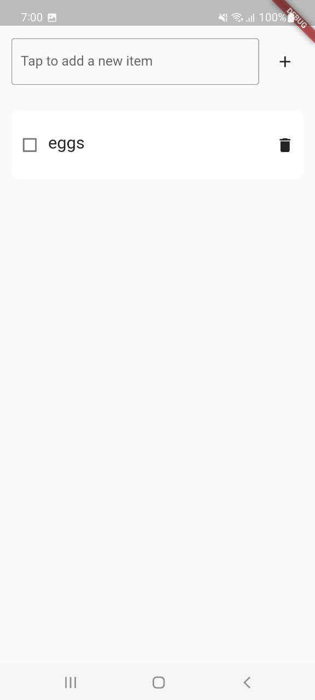

# Shopping List (Flutter)

   
  

The goal of the application is to make everyday shopping easier by enabling the user to list down items to buy.
Using 'My Shopping List' application the user can add/delete new items to buy, and while using it the user can check/uncheck according to the user's needs.

## How to compile and run the application.
The application is created with Flutter and compiled by Android Studio and can be installed on any Android/iOS device.
Just tested with Android devices - Samsung Galaxy A52 and Samsung S22+.

## How to run tests for the application.
At the root of the project, run `flutter test  lib/test/app_test.dart`. There is a lot of room to improve tests, with E2E and Unit tests, but
my focus was to understand how to test a typical Flutter component: a widget.

## A few sentences about the overall architecture of the application.
It is the first time I build a Flutter application from scratch - in the past just tested and read about the framework, but never built
a widget or integrated it with a back-end server. As you can compare, Jetpack Compose is going in the same direction, so the concepts
are not really drastically different in comparison with the Android solution I provided.

I completely overestimated the time to build it - was easy to understand Flutter concepts with my Android knowledge, and FLutter provides
easy libraries to do different tasks, as the `http` package.

Still: I'm pretty sure senior Flutter developers can provide a lot of hints to improve this solution.
